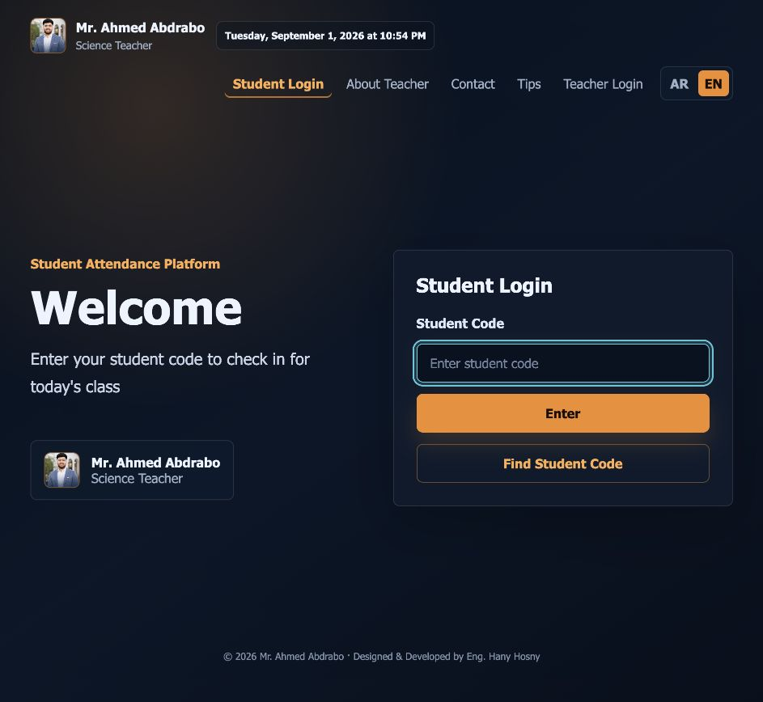

# Attendance Platform

Self-hosted attendance platform for Mr. Ahmed Abdrabo, Science teacher. V1 focuses on the student login flow, attendance check-in through the backend API, and the student dashboard.

## Dashboard Preview

<p align="center">
  
</p>

## Run With Docker

1. Copy the environment file:

```bash
cp .env.example .env
```

2. Start the stack:

```bash
docker compose up --build
```

3. Open the website:

```text
http://localhost:3000
```

The API health endpoint is:

```text
http://localhost:4000/api/health
```

Docker keeps the backend service on the internal port `4000` and the frontend on `3000`.
Railway deploys the services separately with Railpack, so the backend public domain must target
the Railway-assigned backend port, and the frontend must run the production preview command.

## Railway Deployment Settings

Keep these settings aligned with the repository:

- Backend start command: `npm run start --workspace=@abdrabo/backend`.
- Backend public target port: the port printed by the backend (`PORT`), currently `8080`.
- Backend `CORS_ORIGIN`: `https://abdrabo.up.railway.app`.
- Backend `PUBLIC_APP_URL`: `https://abdrabo.up.railway.app` (used by WhatsApp `{portal_link}`).
- Frontend build command: `npm run build --workspace=@abdrabo/frontend`.
- Frontend start command: `npm run start --workspace=@abdrabo/frontend`.
- Frontend `VITE_API_BASE_URL`: `https://abdrabobackend-production.up.railway.app/api`.

### WhatsApp connection persistence

The WhatsApp linked-device credentials are stored in `WHATSAPP_AUTH_DIR` (the
default is `backend/whatsapp_auth`). On Railway, attach a persistent Volume to
the backend service and mount it at `/app/backend/whatsapp_auth`. Without that
volume, a backend redeploy or replacement removes the linked-device session and
requires QR pairing again. Do not attach the volume to the frontend service or
run multiple backend replicas for this single WhatsApp session.

Local `.env` changes do not update Railway Variables. Docker Compose and Railway are separate
deployment paths, even though they use the same source repository.

## Demo Data

- Student code: `STU1001`
- Student: Ahmed Mohamed
- Group: Saturday 6 PM Group
- Demo exam result: Unit One Exam `42/50`

On first startup, the backend creates the database tables and seed data. It also creates an open attendance session around the startup time for local testing.

## Local Development Without Docker

You need Node.js and a local PostgreSQL database.

```bash
npm install
cp .env.example .env
npm run migrate --workspace backend
npm run dev
```

For non-Docker local development, provide `DATABASE_URL` through `backend/.env` or the shell environment.

## Project Structure

- `frontend`: React + Vite bilingual UI.
- `backend`: Node.js + Express + PostgreSQL.
- `backend/src/db/migrate.js`: migrations and seed data.
- `docker-compose.yml`: PostgreSQL + backend + frontend.

## V1 Notes

- Attendance is never recorded directly from the frontend; all check-ins go through `/api/student/login`.
- Backend validation checks the student code, active state, session time window, and duplicate attendance records. Student login attendance does not require geolocation; GPS fields remain empty for those records.
- `device_id` is stored in `localStorage` and sent with attendance requests.
- IP address is only used as supporting suspicious/rate-limiting context, not as the primary protection mechanism.
- UI text is bilingual through a local translations object. Arabic uses RTL and English uses LTR.
